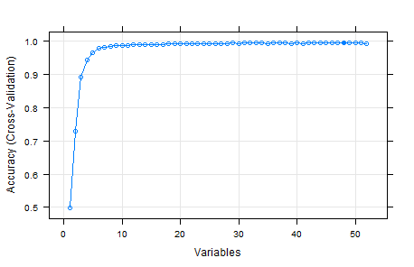

### Synopsis
Using devices such as Jawbone Up, Nike FuelBand, and Fitbit it is now possible to collect a large amount of data about personal activity relatively inexpensively. These type of devices are part of the quantified self movement – a group of enthusiasts who take measurements about themselves regularly to improve their health, to find patterns in their behavior, or because they are tech geeks. One thing that people regularly do is quantify how much of a particular activity they do, but they rarely quantify how well they do it. 

In this project/analysis, our goal is to use data from accelerometers on the belt, forearm, arm, and dumbell of 6 participants and predict the manner in which they did the exercise.

### Cleaning the data

After load the data and take a look on it, I noted that are 100 variables missing in ~97% of the data. Since 3% is a very small set of data to make predictions, I remove these variables.

Since we are not interest in which subject did the exercise, I removed all variables that are related to the subject.

After that, I take a look at the correlation of the 52 variables left and cut off all with more then 0.7 absolute value of correlation. I did this with the **findCorrelation** function of the caret package. So I ended with 33 variables and started to build the model around them.

### Model Building

I used the [caret package](http://topepo.github.io/caret/) for building the model, training the data, predict new cases and estimate the accuracy of the model.

For this classification problem, I choose to use the Random Forest algorithm.

I used the **createDataPartition()** function to split the data in two separated samples and used one for training the data and the other to validate the results. That way, we can see how the model performs in new data and detect any problem before put it on production.

I started with a very small subset of the data to train the model faster, 10%, and pick the best one, after that, I trained the best model using 50% of the data to get a better accuracy.

I used the **rfeControl** and **rfe** function, [Recursive Feature Elimination](http://topepo.github.io/caret/featureselection.html), to train the first model and rank the variables, since complex models take a long time to run and sometimes 
the performance change are VERY small. And then, I plot it to see the results and pick the most important variables.



After taking a look at the graph, I choose to pick 10 variables to make the final model. The variables were selected using the **varImp(modelFit)** function, that list the variables by order of importance to the model.

And then I made my final model:

```{r, eval = FALSE}
modelFit.Best <- train(classe ~ 
                         magnet_dumbbell_z + magnet_belt_z + pitch_forearm +
                         roll_dumbbell + roll_forearm + gyros_belt_z +
                         accel_forearm_x + yaw_dumbbell + roll_arm +
                         gyros_dumbbell_y, data = train, 
                     method="rf", prox = TRUE, 
                     allowParallel = TRUE)
```

And the results for the model are bellow:

```{r, eval=FALSE}
Random Forest

7850 samples
  32 predictor
   5 classes: 'A', 'B', 'C', 'D', 'E'

No pre-processing
Resampling: Bootstrapped (25 reps)

Summary of sample sizes: 7850, 7850, 7850, 7850, 7850, 7850, ...

Resampling results across tuning parameters:

  mtry  Accuracy   Kappa      Accuracy SD  Kappa SD  
   2    0.9383546  0.9219512  0.003503852  0.004448852
   6    0.9305423  0.9120964  0.004701773  0.005988421
  10    0.9148396  0.8922452  0.008830544  0.011210149

Accuracy was used to select the optimal model using  the largest value.
The final value used for the model was mtry = 2.
```

I use the default **bootstrap resampling to cross validate** the data and avoid overfit besides K–fold Cross Validation.

According to John Kuhn, creator of the caret package, this procedure, bootstrap resampling, has low variance but non–zero bias when compared to K–fold Cross Validation.

You can find more about it at this paper [Predictive Modeling with R and the caret Package](http://www.edii.uclm.es/~useR-2013/Tutorials/kuhn/user_caret_2up.pdf)

We can see that the model has an accuracy of ~93.8% and Kappa value of ~0.92 with is considered pretty good.

Since the model uses resampling, we can take a look of how it estimates the error in unseen data, thought the Out Of Bag (OOB) estimate of error, in this case **5.02%**

```{r, eval = FALSE}
> modelFit.Best$finalModel

Call:
randomForest(x = x, y = y, mtry = param$mtry, proximity = TRUE, allowParallel = TRUE)
               Type of random forest: classification
                     Number of trees: 500
No. of variables tried at each split: 2

        **OOB estimate of  error rate: 5.02%**
Confusion matrix:
     A    B    C    D    E class.error
A 2202   14    6    9    1  0.01344086
B   69 1384   49   12    5  0.08887426
C    5   54 1258   47    5  0.08108108
D    7    7   60 1205    8  0.06371406
E    4    5   11   16 1407  0.02494802
```

We can validate the model accuracy using the test data and see the results using the confusionMatrix function:

```{r, eval = FALSE}
> confusionMatrix(predict(modelFit.Best, newdata = test), test$classe)

Confusion Matrix and Statistics

          Reference
Prediction    A    B    C    D    E
         A 3263   85   23    7    3
         B   41 2090   65   10    9
         C   13   75 1917  103   14
         D   18   25   42 1794   17
         E   13    3    6   15 2121

Overall Statistics
                                       
               Accuracy : 0.9501       
                 95% CI : (0.946, 0.954)
    No Information Rate : 0.2844       
    P-Value [Acc > NIR] : < 2.2e-16    
                                       
                  Kappa : 0.9369       
Mcnemar s Test P-Value : 9.171e-11    

Statistics by Class:

                     Class: A Class: B Class: C Class: D Class: E
Sensitivity            0.9746   0.9175   0.9338   0.9300   0.9801
Specificity            0.9860   0.9868   0.9789   0.9896   0.9961
Pos Pred Value         0.9651   0.9436   0.9034   0.9462   0.9829
Neg Pred Value         0.9899   0.9803   0.9859   0.9863   0.9955
Prevalence             0.2844   0.1935   0.1744   0.1639   0.1838
Detection Rate         0.2772   0.1775   0.1628   0.1524   0.1802
Detection Prevalence   0.2872   0.1882   0.1803   0.1611   0.1833
Balanced Accuracy      0.9803   0.9522   0.9563   0.9598   0.9881
```

And we can see that the accuracy was even better with our test data, confirming the model statistics.
