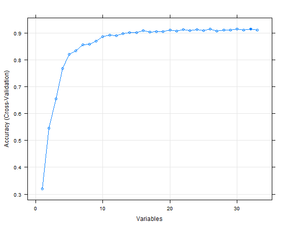

### Synopsis
Using devices such as Jawbone Up, Nike FuelBand, and Fitbit it is now possible to collect a large amount of data about personal activity relatively inexpensively. These type of devices are part of the quantified self movement – a group of enthusiasts who take measurements about themselves regularly to improve their health, to find patterns in their behavior, or because they are tech geeks. One thing that people regularly do is quantify how much of a particular activity they do, but they rarely quantify how well they do it. 

In this project/analysis, our goal is to use data from accelerometers on the belt, forearm, arm, and dumbell of 6 participants and predict the manner in which they did the exercise.

### Cleaning the data

After load the data and take a look on it, I noted that are 100 variables missing in ~97% of the data. Since 3% is a very small set of data to make predictions, I remove these variables.

Since we are not interest in which subject did the exercise, I removed all variables that are related to the subject.

After that, I take a look at the correlation of the 52 variables left and cut off all with more then 0.7 absolute value of correlation. So I ended with 33 variables and build the model around them.

### Model Building

After the data was cleaned, its time to build a model.

I used the caret package for building the model, training the data, predict new cases and estimate the accuracy of the model.

For this classification problem, I choose to use the Random Forest algorithm.

I used the createDataPartition() function to split the data in two separated samples and used one for training the data and the other to validate the results. That way, we can see how the model performs in new data and detect any problem before put it on production.

I started with a very small subset of the data to train the model faster and pick the best one, after that, I trained the best model using 50% of the data, but the performance difference was very small.

I used the rfeControl and rfe function of the caret package [Recursive Feature Elimination](http://topepo.github.io/caret/featureselection.html) to rank the variables and choose a smaller model, since complex models take a long time to run and sometimes 
the performance change are VERY small. And them, I plot it to see the results and pick the important variables.



```{r, eval = FALSE}

```


```{r, eval=FALSE}
# create training set indexes with 10% of data
inTrain <- createDataPartition(y=data$classe,p=0.10, list=FALSE)
# subset data to training
train <- data[inTrain,]
# subset data to test
test <- data[-inTrain,]

modFit <- train(classe ~ ., data = train, method="rf", prox=TRUE)
```

After that, I take a look at the variables importance on the model 

```{r}
modFit
```

I use the default bootstrap resampling to validate the data and avoid overfit besides K–fold Cross Validation.

According to John Kuhn, creator of the caret package, this procedure, bootstrap resampling, has low variance but non–zero bias when compared to K–fold Cross Validation.

You can find more about in at this paper [Predictive Modeling with R and the caret Package](http://www.edii.uclm.es/~useR-2013/Tutorials/kuhn/user_caret_2up.pdf)

We can see that the model has an accuracy of ~93% and Kappa value of ~0.92 with is considered pretty good. The Accuracy and Kappa Standard Deviation is low, so the error rate

Now we will validate the model using the test data and see the results using the confusionMatrix function:

```{r}
predictions <- predict(modFit, newdata = test)
confusionMatrix(predictions, test$classe)
```

And we can see that the accuracy was pretty consistent with our training model results.
